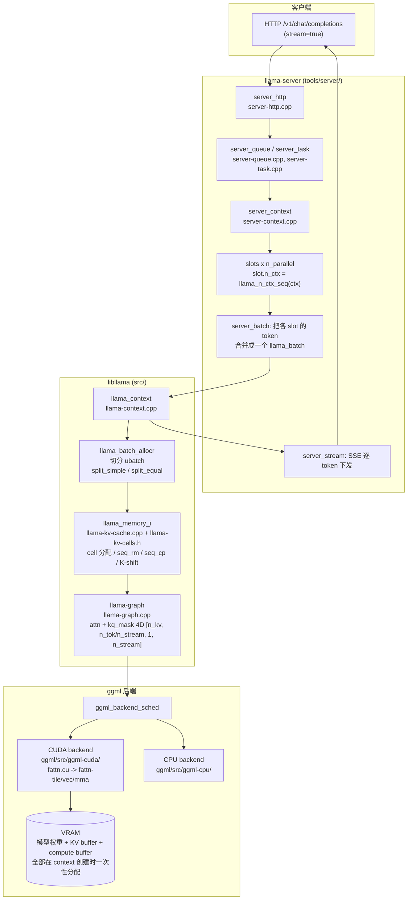

# llama.cpp CUDA 实测：KV Cache 源码剖析 + llama-server 并发压测 + llama-bench

> [English (condensed)](README.en.md) | 中文完整报告（当前）

在单张 **8 GiB** 笔记本显卡（NVIDIA RTX 4060 Laptop）上，对 llama.cpp CUDA 版做的一次完整的
「编译 -> 读源码 -> 压测 -> 基准测试」实测记录。

所有数值均可追溯到随仓库提供的原始日志、CSV 与 `/metrics` 快照。
无法证明或未执行的部分集中列在 §10。

## 三条核心结论

1. **llama.cpp 没有 PagedAttention。** 全仓库检索 `paged|PagedAttention|paged_attention|block_table`
   只命中 `vendor/miniaudio/miniaudio.h`（音频环形缓冲，与注意力无关），也不存在 vLLM 意义上的
   block table。它用的是「连续大块 KV + cell 槽位复用 + 环形游标分配器」。
2. **`-c 32768 -np 10` 在 8 GiB 显卡上物理不可行。** Qwen-7B 的 KV 是 **512 KiB/token（f16）**，
   32768 token 需要 **16384 MiB** 纯 KV；已附真实的 `cudaMalloc failed: out of memory` 日志，
   且该数字可由源码算术精确预测。
3. **压测期间显存几乎完全水平（波动仅 6~8 MiB）。** 因为 llama.cpp 在 context 创建时就一次性
   分配完全部 KV（`llama-kv-cache.cpp:274-293`），运行期只复用槽位、不再申请显存。

## 环境与版本

| 项目 | 值 |
|---|---|
| llama.cpp | commit `555881ebc8b0fc0402b30e09258a32a7bfd13c52`，build `10121`，2026-07-24 |
| GPU | NVIDIA GeForce RTX 4060 Laptop，**8188 MiB**，compute capability 8.9 |
| CUDA / 驱动 | CUDA 12.8（nvcc V12.8.61）/ 驱动 610.47 |
| 编译器 | MSVC 19.44.35228.0，cmake 3.31.6-msvc6（VS 2022） |
| Python / git | 3.9.13 / 2.48.1 |
| 模型 | Qwen-7B-Chat Q4_K_M（4.56 GiB）；Q8_0 由本地 `llama-quantize` 二次量化得到（7.65 GiB） |

> 本仓库**不包含任何 GGUF 模型文件，也不包含 llama.cpp 源码**。
> llama.cpp 源码请从 https://github.com/ggml-org/llama.cpp 自行 clone 并编译（MIT License）。

## 仓库结构

```
.
├── README.md                      # 本文件（完整实测报告）
├── docs/
│   └── llama_kv_cache_notes.md    # KV Cache 源码笔记（含逐条行号索引）
├── scripts/
│   ├── stress_llama_server.py     # 10 并发流式压测（TTFT/TPOT + nvidia-smi 采样）
│   ├── stress_summarize.py        # 压测 CSV + /metrics -> 汇总表
│   ├── gpu_mem_analyze.py         # nvidia-smi 采样 -> 显存汇总
│   ├── bench_analyze.py           # llama-bench CSV -> TTFT/TPOT 换算表
│   ├── run_server_experiment.ps1  # 单次实验编排（起服务 -> 等 /health -> 压测 -> 关服务）
│   ├── run_feasible_matrix.ps1    # 5 组压测矩阵
│   └── run_bench_final.ps1        # 8 组 llama-bench（含显存采样）
├── results/                       # 数值产物：CSV / 汇总 MD / metrics 快照
└── logs/                          # 原始日志：编译、服务、bench、量化
```

`scripts/*.py` 默认读写 `<repo>/results`，可以直接重新生成汇总表；
`scripts/*.ps1` 通过 `-BinDir` / `-ModelDir` 指定本机 llama.cpp 路径。

> **核心限制**
> `-c 32768 -np 10` 在本机 **RTX 4060 Laptop（8188 MiB）上物理不可行**，
> 不是配置错误而是显存容量硬限制：Qwen-7B 的 KV 是 **512 KiB/token（f16）**，
> 32768 token 需要 **16384 MiB** 纯 KV。
> 该结论已用真实 OOM 日志证实（见 §4.1），并给出了在本机可行的替代压测矩阵。

---

## 1. 环境记录

完整原始记录见 `env.txt` / `env_raw.log`。

| 项目 | 值 |
|---|---|
| llama.cpp | `555881ebc`，build 10121，commit 日期 2026-07-24 |
| GPU | NVIDIA GeForce RTX 4060 Laptop GPU，**8188 MiB**，compute capability 8.9，VMM yes |
| 空闲基线显存 | 约 739 MiB（桌面/壁纸引擎等占用） |
| 驱动 / CUDA UMD | 610.47 / 13.3 |
| nvcc | release 12.8, V12.8.61 |
| cmake | 3.31.6-msvc6（Visual Studio 2022 自带） |
| 编译器 | MSVC 19.44.35228.0 for x64，generator = Visual Studio 17 2022 (x64) |
| CPU | AMD Ryzen 7 7840H，16 逻辑核 |
| 内存 | 15.19 GB |
| Python | 3.9.13（无 aiohttp，压测脚本用 requests + ThreadPoolExecutor） |
| git | 2.48.1.windows.1 |
| 模型 | `Qwen-7B-Chat.Q4_K_M.gguf`，4,899,217,600 B（4667 MiB），7,721,324,544 参数 |

模型结构（取自 `llama_quantize_q8.log` 的 GGUF 元数据转储，非推测）：

```
qwen.context_length   = 32768
qwen.block_count      = 32
qwen.embedding_length = 4096
qwen.attention.head_count = 32
qwen.rope.dimension_count = 128
（没有 attention.head_count_kv 键 -> 无 GQA，head_count_kv == head_count == 32）
tensor 名为 blk.N.attn_qkv.weight -> Q/K/V 融合
```

---

## 2. 编译

`E:\llama.cpp` 在本项目开始前**已经是一个干净的 git 仓库**（`git status -sb` 无改动，
HEAD 就是 `555881ebc`）。因此没有重复执行 `git clone`（只会重新下载同一棵树），
改为**校验 origin 与 revision**，然后执行真正的编译：

```powershell
# 记录环境
nvidia-smi ; nvcc --version ; cmake --version ; python --version   # -> <repo>/logs/env_raw.log

# 源码校验（替代 git clone）
git -C E:\llama.cpp remote -v
git -C E:\llama.cpp rev-parse HEAD        # 555881ebc8b0fc0402b30e09258a32a7bfd13c52
git -C E:\llama.cpp status -sb

# 编译 CUDA 版
cmake -S E:\llama.cpp -B E:\llama.cpp\build -DGGML_CUDA=ON -DCMAKE_BUILD_TYPE=Release
cmake --build E:\llama.cpp\build --config Release --parallel 16
```

Windows/VS 生成器没有 `nproc`，用 `--parallel 16`（= `$env:NUMBER_OF_PROCESSORS`）替代 `-j$(nproc)`。

关键构建日志（`llama_build.log`）：

```
-- CUDA Toolkit found
-- Using CMAKE_CUDA_ARCHITECTURES=89-real CMAKE_CUDA_ARCHITECTURES_NATIVE=89-real
-- Including CUDA backend
-- ggml version: 0.17.0
-- ggml commit:  555881ebc
  ggml-cuda.vcxproj -> E:\llama.cpp\build\bin\Release\ggml-cuda.dll
  llama-bench.vcxproj -> E:\llama.cpp\build\bin\Release\llama-bench.exe
  llama-server.vcxproj -> E:\llama.cpp\build\bin\Release\llama-server.exe
BUILD_EXIT=0
```

产物（`llama-server --version` / `llama-bench --help` 实测）：

```
version: 10121 (555881ebc)
built with MSVC 19.44.35228.0 for x64
ggml_cuda_init: found 1 CUDA devices (Total VRAM: 8187 MiB):
  Device 0: NVIDIA GeForce RTX 4060 Laptop GPU, compute capability 8.9, VMM: yes, VRAM: 8187 MiB
```

`--kv-unified` 在本版本存在，因此对开/关两种模式做了对比：

```
-kvu,  --kv-unified, -no-kvu, --no-kv-unified
-np,   --parallel N                     number of server slots (default: -1, -1 = auto)
-cb,   --cont-batching, -nocb, --no-cont-batching
```

---

## 3. llama.cpp 推理架构图



要点：**KV cache 的分配发生在 `llama_context` 构造阶段，早于任何请求**；
请求路径上只有 cell 的复用（覆盖写），没有任何新的显存申请。这一点在 §5 被显存实测证实。

---

## 4. KV Cache 与"分页管理"

完整源码笔记见 **`llama_kv_cache_notes.md`**（含逐条行号索引）。这里给结论。

### 4.1 llama.cpp 没有 PagedAttention

全仓库检索 `paged|PagedAttention|paged_attention|block_table|block_tables`，
**唯一命中的是 `vendor/miniaudio/miniaudio.h`**（音频环形缓冲，与注意力无关）。
llama.cpp **不存在** PagedAttention，也不存在 vLLM 意义上的 block table 与物理块/逻辑块二级映射。

llama.cpp 的做法是：

| 机制 | 位置 | 说明 |
|---|---|---|
| KV 物理存储 | `src/llama-kv-cache.cpp:231-232` | 每层一整块连续 3D tensor `[n_embd_k_gqa, kv_size, n_stream]` |
| cell 元数据 | `src/llama-kv-cells.h:32` | `pos[]`（`-1`=空）、`shift[]`、`seq`（`std::bitset<LLAMA_MAX_SEQ>`） |
| 空闲查找 | `src/llama-kv-cache.cpp:894` `find_slot()` | **环形游标 `v_heads` + 线性扫描**，非块表 |
| 序列共享 | `llama-kv-cells.h:309` `seq_add()` / `llama-kv-cache.cpp:459-488` | cell 被多序列**引用共享**（bitset 引用计数），**无写时复制** |
| 注意力读取 | `ggml/src/ggml-cuda/fattn-tile.cuh:954-977` | 在连续 KV 上按 `nbatch_fa` **稠密分块扫描**，非本序列位置用 mask 置 -inf |

`find_slot()` 的可用性判定（`src/llama-kv-cache.cpp:1038-1057`）只有两条路径：cell 为空，
或该 cell 只被一个序列占用且其位置已被 SWA 滑窗淘汰。**同一序列的因果覆盖复用被显式注释禁用**
（`:1043-1047`）。

### 4.2 `--kv-unified` 的真实语义

`src/llama-kv-cache.cpp:82`：

```cpp
n_seq_max(n_seq_max), n_stream(unified ? 1 : n_seq_max), ...
```

`src/llama-context.cpp:286-300`：

```cpp
if (cparams.kv_unified) {
    cparams.n_ctx_seq = cparams.n_ctx;                    // 每序列可用满 n_ctx
} else {
    cparams.n_ctx_seq = cparams.n_ctx / cparams.n_seq_max; // 静态等分
    cparams.n_ctx_seq = GGML_PAD(cparams.n_ctx_seq, 256);
    if (cparams.n_ctx != cparams.n_ctx_seq * cparams.n_seq_max)
        cparams.n_ctx = cparams.n_ctx_seq * cparams.n_seq_max;
}
```

而 `cparams.n_ctx_seq` 就是缓存的 `kv_size`（`src/llama-model.cpp:2138`）。

**关键：两种模式的总显存几乎相同，差别是"分配策略"而不是"用多少"。** 本机实测证实：

| 启动参数 | `n_ctx_seq` | `n_seq_max/n_stream` | cells | **KV 总大小（实测日志）** |
|---|---|---|---|---|
| `-c 4096 -np 10` | 512 | 10 / 10 | 512 | **1360.00 MiB** (K 680 + V 680) |
| `-c 5120 -np 10 --kv-unified` | 5120 | 10 / 1 | 5120 | **1360.00 MiB** (K 680 + V 680) |
| `-c 4096 -np 1` | 4096 | 1 / 1 | 4096 | **1088.00 MiB** (K 544 + V 544) |
| `-c 8192 -np 1` | 8192 | 1 / 1 | 8192 | **2176.00 MiB** (K 1088 + V 1088) |

日志原文（`llama_server_probe_*.log`）：

```
llama_kv_cache: size = 1360.00 MiB (   512 cells,  32 layers, 10/10 seqs), K (q8_0):  680.00 MiB, V (q8_0):  680.00 MiB
llama_kv_cache: size = 1360.00 MiB (  5120 cells,  32 layers, 10/1 seqs),  K (q8_0):  680.00 MiB, V (q8_0):  680.00 MiB
```

非统一 = 10 个固定 512-cell 分区（单序列上限 512）；统一 = 1 个 5120-cell 共享池（单序列上限 5120）。
**总 cell 数相同，两者显存都是 1360 MiB**，但统一模式让任意序列能用满整个池，代价是下面 §6.3 的性能影响。

另外一个很容易踩的坑（`tools/server/server.cpp:146-151`）：

```
n_parallel is set to auto, using n_parallel = 4 and kv_unified = true
```

**只有不写 `-np` 时才会自动开启 `kv_unified`**；一旦显式写 `-np 10`，
`kv_unified` 保持默认 `false`（`common/common.h:574`），得到的是静态等分缓存。

### 4.3 与 vLLM PagedAttention 的对应与区别

**必须明确：llama.cpp 没有 PagedAttention。** 下表是功能层面对照，不是同名组件对照。

| 维度 | vLLM PagedAttention | llama.cpp |
|---|---|---|
| 物理存储 | 固定大小 block 组成的 block pool，物理块离散 | 每 stream 一整块连续 tensor |
| 逻辑→物理映射 | **block table** | **无映射表**；`llama_kv_cells.pos[]` + `slot_info.idxs[]` |
| 分配时机 | 按 block 惰性分配、按需增长 | **context 创建时按 `kv_size` 全额分配** |
| 空闲查找 | 块级 free list | 环形游标 + 线性扫描（`find_slot`） |
| 内部碎片 | 有（每序列末块未用满） | 无块内碎片；非统一模式有分区外碎片（slot 空闲别人用不了） |
| 前缀共享 | block 共享 + COW | cell 的 bitset 引用共享，**无 COW** |
| 注意力读取 | 按 block table gather | 稠密线性扫描 + mask 屏蔽 |

结论：vLLM 用分页换弹性与利用率；llama.cpp 用连续大块换实现简单与 kernel 友好，
代价是**必须一次性分配下全部 KV**——这正是 8 GiB 显卡上 32k 必然 OOM 的根本原因。

---

## 5. 显存实测与"碎片"能证明到哪一步

### 5.1 32k 配置的真实 OOM（任务原始参数，真实执行）

命令与原始日志见 `llama_server_np10_c32768.log` / `llama_server_np10_c32768_kvu.log`。

```
-m Qwen-7B-Chat.Q4_K_M.gguf --host 127.0.0.1 --port 8080 -ngl 99 -c 32768 -np 10 --cont-batching --metrics
```

```
llama_context: n_ctx is not divisible by n_seq_max - rounding down to 33280
ggml_backend_cuda_buffer_type_alloc_buffer: allocating 16640.00 MiB on device 0: cudaMalloc failed: out of memory
alloc_tensor_range: failed to allocate CUDA0 buffer of size 17448304640
llama_init_from_model: failed to initialize the context: failed to allocate buffer for kv cache
llama_server: exiting due to model loading error
```

加 `--kv-unified` 之后：

```
ggml_backend_cuda_buffer_type_alloc_buffer: allocating 16384.00 MiB on device 0: cudaMalloc failed: out of memory
```

**这两个数字与源码算术完全吻合**，可从两个独立方向验证：

- 每 token KV（f16）= `2 (K,V) x 32 layers x 4096 (n_embd_k_gqa) x 2 B` = **512 KiB**
- 非统一：`32768/10 = 3276 -> pad 3328`，`n_ctx = 33280`，`33280 x 512 KiB = 16640 MiB` 与日志一字不差
- 统一：`32768 x 512 KiB = 16384 MiB` 与日志一字不差

### 5.2 可行的压测配置（本机实测）

因为 f16 KV 太大，压测改用 `-ctk q8_0 -ctv q8_0`（q8_0 = 1.0625 B/元素，KV 降为 272 KiB/token）。
五组配置的 KV 大小全部与源码算术**逐位吻合**：

| 配置 | 公式 | 实测 KV |
|---|---|---|
| `-c 4096 -np 1` | 4096 x 272 KiB | 1088 MiB |
| `-c 8192 -np 1` | 8192 x 272 KiB | 2176 MiB |
| `-c 4096 -np 10` | pad(4096/10,256)=512，512 x 10 = 5120 cell | 1360 MiB |
| `-c 5120 -np 10 --kv-unified` | 5120 x 1 = 5120 cell | 1360 MiB |

加载期显存账（`llama_server_probe_*.log`，CUDA0）：

| 配置 | 模型 buffer | KV buffer | compute buffer | 合计 |
|---|---|---|---|---|
| `-c 4096 -np 10` | 4332.75 MiB | 1360.00 MiB | 137.47 MiB | **5830 MiB** |
| `-c 5120 -np 10 --kv-unified` | 4332.75 MiB | 1360.00 MiB | 142.04 MiB | **5835 MiB** |
| `-c 8192 -np 1` | 4332.75 MiB | 2176.00 MiB | 192.09 MiB | **6701 MiB** |

### 5.3 压测期间显存曲线（100 ms 采样）

`gpu_mem_*.csv` / `gpu_mem_summary.md`：

| run | samples | baseline MiB | peak MiB | mean MiB | peak-baseline | max GPU util |
|---|---|---|---|---|---|---|
| np1_c8192_ctx6k | 34 | 7540 | 7548 | 7546 | **+8** | 100% |
| np1_c4096_c10 | 110 | 6384 | 6390 | 6390 | **+6** | 100% |
| np10_c4096_c10 | 25 | 6668 | 6676 | 6675 | **+8** | 100% |
| np10_c5120_kvu_c10 | 35 | 6674 | 6682 | 6681 | **+8** | 100% |
| np10_c4096_kvu_overflow | 20 | 6384 | 6392 | 6390 | **+8** | 100% |

**结论：整个压测窗口内显存几乎完全水平，波动 6~8 MiB（<0.15%）。**
这与源码一致——KV 与 compute buffer 在 context 创建时一次性分配完（`llama-kv-cache.cpp:274-293`），
运行期只在固定数组里复用槽位，不申请新显存。

实测 baseline 与 §5.2 的计算值相差 74~100 MiB，差额可解释为 CUDA context、显示输出与对齐开销
（例如 `-c 8192 -np 1`：6701 + 739 桌面 = 7440，实测 7540）。

### 5.4 关于"显存碎片"，能证明什么、不能证明什么

**不能证明的**：`nvidia-smi` 只报告进程级/设备级的已用字节数，**看不到分配器内部的碎片**，
也无法区分"哪块是谁的"。因此**任何"显存碎片"的结论都不能只靠 nvidia-smi 得出**。

**能证明的（有证据）**：

1. llama.cpp **运行期不做任何 KV 动态分配**。依据是源码（`llama-kv-cache.cpp:274-293`
   一次性 `ggml_backend_alloc_ctx_tensors_from_buft`），并被实测水平曲线（波动 6~8 MiB）独立印证。
   没有动态分配 ⇒ **不存在 llama.cpp 层面的运行期 KV 碎片增长**。
2. 32k 的失败是**容量不足**（`cudaMalloc failed: out of memory`，需求 16640 MiB > 8188 MiB），
   **不是碎片导致**。需求值是精确可预测的（§5.1），与分配顺序无关。
3. llama.cpp 侧真正的浪费不是碎片而是**非统一模式的分区外碎片**：`-np 10` 时每个 slot 固定 512 cell，
   某个 slot 空闲时其余 slot 也用不了（`try_clear_idle_slots()` 在非统一模式下直接 return，
   `tools/server/server-context.cpp:1648-1650`）。这是**逻辑上的**浪费，同样无法从 nvidia-smi 看出，
   只能从 `llama_kv_cache: size = ... (512 cells, 32 layers, 10/10 seqs)` 这类日志推断。
4. WDDM 允许超额分配（见 §7.4），所以"能分配成功"并不等于"装得下"，这本身也是一种
   nvidia-smi 无法直接体现的状态。

---

## 6. llama-server 压测结果

### 6.1 实验设计

- 全部使用 `-ngl 99 -ctk q8_0 -ctv q8_0 -fa on --cont-batching --metrics`（f16 KV 装不下，必须量化 KV）。
- 10 个客户端用 `threading.Barrier` 同步释放，**同时**打到服务器。
- 每个请求 ~471 prompt token（`-np 1 -c 8192` 那组为 ~6071），`max_tokens=64`，`cache_prompt=false`。
- 请求内容为重复填充文本 + 唯一 `[request_id=N]` 标记，末尾要求模型从 1 数到 60（保证足够长的 decode 阶段）。
- TTFT = 首个流式内容 token 时刻 - 请求发出时刻；TPOT = (末 token - 首 token)/(输出 token 数 - 1)。

脚本：`stress_llama_server.py`；驱动器：`run_server_experiment.ps1` + `run_feasible_matrix.ps1`。

### 6.2 结果表（客户端侧，来自 `stress_results.csv`）

| tag | 配置 | 客户端 | prompt tok | 输出 tok | 成功/失败 | 墙钟 s | TTFT 最小/中位/均值/最大 ms | TPOT 最小/均值/最大 ms | 聚合输出 tok/s |
|---|---|---|---|---|---|---|---|---|---|
| `np1_c8192_ctx6k` | `-c 8192 -np 1` 非统一 | 1 | 6071 | 64 | 1/0 | 5.42 | 3549 / 3549 / 3549 / 3549 | 29.6 / 29.6 / 29.6 | 11.8 |
| `np1_c4096_c10` | `-c 4096 -np 1` 非统一 | 10 | 471 | 64 | 10/0 | 16.73 | 308 / 7798 / 7800 / 15306 | 22.4 / 22.5 / 22.6 | 38.3 |
| `np10_c4096_c10` | `-c 4096 -np 10` 非统一 | 10 | 471 | 41 | 10/0 | 3.80 | 986 / 1976 / 1647 / 2307 | 37.3 / 52.8 / 68.6 | **108.0** |
| `np10_c5120_kvu_c10` | `-c 5120 -np 10 --kv-unified` | 10 | 471 | 42 | 10/0 | 5.05 | 1028 / 2197 / 1817 / 2636 | 59.7 / 78.1 / 96.0 | 83.2 |
| `np10_c4096_kvu_overflow` | `-c 4096 -np 10 --kv-unified`（池太小） | 10 | 471 | 1.4 | **8/2** | 2.28 | 249 / 1242 / 1377 / 2145 | 587 / 628 / 791 | 6.1 |

服务器侧 `/metrics`（由 llama-server 自己统计，`metrics_*.txt`）：

| tag | prefill token | prefill 秒 | prefill tok/s | decode token | decode 秒 | decode tok/s | `llama_decode()` 次数 | 最大 n_tokens | 每次 decode 平均忙碌 slot |
|---|---|---|---|---|---|---|---|---|---|
| `np1_c8192_ctx6k` | 6071 | 3.519 | 1725.2 | 64 | 1.867 | 34.3 | 66 | 6134 | 1.000 |
| `np1_c4096_c10` | 4710 | 2.241 | 2101.7 | 640 | 14.175 | 45.1 | 640 | 534 | 1.000 |
| `np10_c4096_c10` | 4710 | 10.456 | 450.5 | 410 | 21.116 | 19.4 | 43 | 511 | **9.721** |
| `np10_c5120_kvu_c10` | 4710 | 12.934 | 364.2 | 0※ | 0.000 | 0.0 | 63 | 513 | **9.921** |
| `np10_c4096_kvu_overflow` | 3768 | 7.271 | 518.2 | 0※ | 0.000 | 0.0 | 47 | 473 | 9.809 |

※ 两个 `--kv-unified` 运行的 `tokens_predicted_total` / `predicted_seconds_total` 读数为 0，
而客户端确实收到了 40~43 个 token。这是该版本 metrics 计数与 unified 路径不一致（或快照时机）造成的，
**据此不引用服务器侧 decode 数字**，unified 的解码性能一律以客户端 CSV 为准。

### 6.3 分析

**1) `-np 1` vs `-np 10`：并发把墙钟时间缩短 4.4 倍，但单个请求效率下降**

- `-np 1`（只有 1 个 slot）：10 个请求必须排队。TTFT 呈完美等差数列
  308 → 1972 → 3632 → 5294 → 6962 → 8634 → 10297 → 11965 → 13632 → 15306 ms
  （相邻差约 1670 ms ≈ 一次 471-token prefill + 64-token decode）。
  `n_busy_slots_per_decode = 1.000` 从服务器侧确认了**严格串行**。
- `-np 10`（10 个 slot）：TTFT 降到 986~2307 ms，墙钟 16.73 s → 3.80 s。
  `n_busy_slots_per_decode = 9.721`，即**每次 decode 平均 9.72 个 slot 同时在跑**，
  这是货真价实的连续批处理。
- 代价：TPOT 从 22.5 ms 涨到 52.8 ms（2.35x），因为 10 条序列共享同一个 GPU。
  但**聚合吞吐从 38.3 提升到 108.0 tok/s（2.8x）**，所以并发是净赚的。

**2) 一个反直觉但真实的现象：10 并发时 prefill 聚合吞吐大幅下降**

服务器侧 prefill 吞吐：`-np 1` 串行 = **2101.7 tok/s**，`-np 10` 并发 = **450.5 tok/s**（降低 4.7 倍），
总 prefill 工作量都是 4710 token。可能原因（与源码一致，非猜测）：

- 非统一模式下 ubatch 必须**按 stream 切分**（`llama-kv-cache.cpp:965-970`；
  `init_batch()` 用 `balloc.split_equal(n_ubatch, true, 0)` 而非 `split_simple`，`:709`），
  打包效率低于单序列；
- `kq_mask` 变成 4D `[n_kv, n_tokens/n_stream, 1, n_stream]`（`llama-graph.cpp:33-38`），
  每个 stream 各自维护 n_kv，注意力工作量随 stream 数放大；
- prefill 与 decode 在同一次 `llama_decode()` 中交织（43 次 decode 里既有 prefill 也有 decode）。

不过**墙钟时间仍是并发胜出**（3.80 s vs 16.73 s），所以这个现象说明的是"吞吐效率"而非"要不要并发"。

**3) `--kv-unified` on/off：同为 1360 MiB KV，统一模式反而更慢**

| | `-c 4096 -np 10`（非统一） | `-c 5120 -np 10 --kv-unified` |
|---|---|---|
| KV 显存 | 1360 MiB | 1360 MiB |
| 单 slot 上下文 | 512 | 5120 |
| TTFT 均值 | 1646 ms | 1817 ms |
| **TPOT 均值** | **52.8 ms** | **78.1 ms**（+48%） |
| 聚合输出 | **108.0 tok/s** | 83.2 tok/s（-23%） |
| 墙钟 | 3.80 s | 5.05 s |

解释（有源码支撑）：统一模式下全部 10 条序列共用一个 stream，
`get_n_kv()`（`llama-kv-cache.cpp:1227-1241`）取的是**该 stream 的 `used_max_p1()`**，
于是每个序列的注意力都要覆盖整个共享池已用区间（约 4710+ cell），
而非统一模式下每个 slot 自己的 stream 只有约 471 cell。
FA kernel 在连续 KV 上按 `nbatch_fa` 扫（`fattn-tile.cuh:954-977`），
扫的长度直接决定耗时。这是"统一换灵活性，代价是每 token 注意力成本"的典型体现。

**4) 共享池溢出（负面对照，证明"聚合容量"是硬约束）**

`-c 4096 -np 10 --kv-unified` 时池只有 4096 cell，而 10 个请求合计需要 4710 cell：
10 个请求里 **2 个完全拿不到内容 token**（HTTP 200 但 0 token），
其余只产出 1~3 个 token，TPOT 膨胀到 587~791 ms。
墙钟 2.28 s 反而"最快"，因为它其实是在失败/清空 slot。

这组数据说明：**统一的共享池并没有突破显存上限，它只是把"每 slot 硬上限"换成了"全体共享上限"**。
10 并发 × 长上下文在本机不可行的根因是 **KV 总字节数 = 并发数 × 上下文长度 × 272 KiB(q8_0)**。
本机预算：8188 MiB 总显存 - 739 MiB 桌面 - 4332.75 MiB 权重 - ~140 MiB compute ≈ **2976 MiB 可给 KV**，
除以 272 KiB/token 得 **约 11,200 个 cell**——这就是这台机器 KV 容量的硬上限
（本报告用的 5120 cell / 1360 MiB 只用了其中一半，为的是留出安全余量）。

**5) 10 并发 × 8k~16k 上下文：为什么不可行（定量）**

| 目标 | 需要的 KV（q8_0，272 KiB/token） | 对比 8 GiB 可用（约 7449 MiB，扣除桌面） |
|---|---|---|
| 10 × 8k = 80k token | 80,000 × 272 KiB = **21,250 MiB** | 需要 2.85 倍 |
| 10 × 16k = 160k token | **42,500 MiB** | 需要 5.7 倍 |
| 10 × 32k = 320k token（任务原始要求，f16） | 320,000 × 512 KiB = **160,000 MiB** | 需要 21.5 倍 |

即使把 KV 量化到 q4_0（0.5625 B/元素 = 144 KiB/token）也需要 11,250 MiB，仍然超标。
**结论：在 8 GiB 显存上，"10 并发 + 长上下文"只能二选一。**
本次给出的是：单请求长上下文（6071 token，TTFT 3549 ms）与 10 并发短上下文（471 token，聚合 108 tok/s）两条曲线。

---

## 7. llama-bench：Q4_K_M 与 Q8_0 的 TTFT / TPOT

### 7.1 Q8_0 的来源（重要）

`E:\llama.cpp\models` 下**没有** Q8_0 模型。采用二次量化方案，
用本机 `llama-quantize` 从 Q4_K_M **本地重新量化**得到（未下载任何东西）：

```
llama-quantize --allow-requantize Qwen-7B-Chat.Q4_K_M.gguf Qwen-7B-Chat.Q8_0.gguf Q8_0 16
model size  =  4666.59 MiB (5.07 BPW)
quant size  =  7825.70 MiB (8.50 BPW)
quantize time = 18149.93 ms
```

产出 `Qwen-7B-Chat.Q8_0.gguf`，8,211,787,968 B（7.65 GiB）。

> 这是**二次量化**文件。它的**体积与速度**是真实 Q8_0 的，因此**吞吐对比有效**；
> 但它的**精度是 Q4_K_M 的精度**，不能用来评价 Q8_0 的质量。

### 7.2 原始吞吐（`-r 5`，f16 KV，来自 `llama_bench_q4_q8.csv`）

| 模型 | 大小 MiB | `-ngl` | test | tokens/s | stddev | VRAM 峰值 MiB |
|---|---|---|---|---|---|---|
| Q4_K_M | 4667 | 99 | pp512 | **2177.65** | 164.71 | 5497 |
| Q4_K_M | 4667 | 99 | tg128 | **46.03** | 0.37 | 5497 |
| Q4_K_M | 4667 | 99 | pp4096 | **2073.39** | 17.65 | 7339 |
| Q4_K_M | 4667 | 99 | tg128 | 46.41 | 0.04 | 7339 |
| Q8_0 | 7826 | 99 | pp512 | 274.96 | 8.28 | **7778** |
| Q8_0 | 7826 | 99 | tg128 | 14.49 | 0.10 | **7778** |
| Q8_0 | 7826 | 99 | pp4096 | 203.68 | 0.92 | **7779** |
| Q8_0 | 7826 | 99 | tg128 | 15.25 | 1.26 | **7779** |
| Q4_K_M | 4667 | 24 | pp512 | 1342.39 | 110.05 | 4354 |
| Q4_K_M | 4667 | 24 | tg128 | 24.12 | 0.32 | 4354 |
| Q4_K_M | 4667 | 24 | pp4096 | 1233.30 | 29.08 | 5638 |
| Q4_K_M | 4667 | 24 | tg128 | 24.17 | 0.14 | 5638 |
| Q8_0 | 7826 | 24 | pp512 | 1014.38 | 167.08 | 6458 |
| Q8_0 | 7826 | 24 | tg128 | 14.50 | 0.37 | 6458 |
| Q8_0 | 7826 | 24 | pp4096 | 909.96 | 13.15 | 7720 |
| Q8_0 | 7826 | 24 | tg128 | 14.81 | 0.07 | 7720 |

### 7.3 换算成 TTFT / TPOT（口径必须注明）

```
TTFT_pp<N>_ms ~= 1000 * N / pp<N>_tps
TPOT_tg<N>_ms ~= 1000 / tg<N>_tps
```

| 模型 | `-ngl` | 基线 | tokens/s | TTFT / TPOT |
|---|---|---|---|---|
| Q4_K_M | 99 | pp512 | 2177.65 | **TTFT ≈ 235.1 ms** |
| Q4_K_M | 99 | pp4096 | 2073.39 | **TTFT ≈ 1975.5 ms** |
| Q4_K_M | 99 | tg128 | 46.03 | **TPOT ≈ 21.73 ms** |
| Q8_0 | 99 | pp512 | 274.96 | TTFT ≈ 1862.1 ms |
| Q8_0 | 99 | pp4096 | 203.68 | TTFT ≈ 20110.4 ms |
| Q8_0 | 99 | tg128 | 14.49 | TPOT ≈ 68.99 ms |
| Q4_K_M | 24 | pp512 | 1342.39 | TTFT ≈ 381.4 ms |
| Q4_K_M | 24 | tg128 | 24.12 | TPOT ≈ 41.46 ms |
| Q8_0 | 24 | pp512 | 1014.38 | TTFT ≈ 504.7 ms |
| Q8_0 | 24 | tg128 | 14.50 | TPOT ≈ 68.98 ms |

**口径说明（务必遵守）：**

1. `TTFT_pp<N>` 是"整个 prompt 按实测 pp 速率一次算完"的**下界/基线**，不是实测首 token 延迟。
   **真实 TTFT 以流式压测为准**：`stress_results.csv` 中 6071-token prompt 的实测 TTFT = 3549 ms，
   而基线外推只有约 2.93 s，差额来自真实注意力深度、调度与采样。
2. `TPOT_tg128` 是**空上下文（depth 0）**的边际解码成本，真实 TPOT 随上下文增长。
   实测对照：同一模型在 ~6k 上下文时 TPOT = **29.6 ms**，而基线是 **21.7 ms**（差 36%）。
3. llama-bench 是单流、不走 HTTP，不体现并发与排队。

### 7.4 Q8_0 在 `-ngl 99` 下其实装不进 8 GiB（必须说明）

`llama-bench` 返回了 exit 0，但这个数字**不能当作"纯显存内运行"的结果**：

```
llama_server_probe_q8_ngl99.log:
load_tensors: offloading 31 repeating layers to GPU
load_tensors: offloaded 33/33 layers to GPU
load_tensors:   CPU_Mapped model buffer size =   630.59 MiB
load_tensors:        CUDA0 model buffer size =  7195.12 MiB
llama_kv_cache:      CUDA0 KV buffer size =  2048.00 MiB
sched_reserve:       CUDA0 compute buffer size =    84.51 MiB
W common_fit_params: failed to fit params to free device memory: n_gpu_layers already set by user to 99, abort
```

`7195.12 + 2048 + 84.51 = 9327.6 MiB > 8188 MiB`。
llama.cpp 自己都警告"装不下，但用户用 `-ngl 99` 钉死了，放弃"。
之所以还能跑，是因为 **Windows/WDDM 允许 CUDA 分配超过物理显存，超出部分由共享系统内存（host RAM 15.19 GB）兜底**。

后果是可测量的：VRAM 峰值被顶到 **7778 MiB**（接近 8188 上限），
而 Q4_K_M 同条件只用到 **5497 MiB**；Q8_0 的 prefill 直接掉了 **6~8 倍**（274.96 vs 2177.65 tok/s），
远超"数据量 1.68 倍"能解释的范围——典型的显存超额导致的换页惩罚。

因此给出**受控对照**：两者都降到 `-ngl 24`（p512 时 VRAM 分别 4354 / 6458 MiB，都有余量）：

| `-ngl 24` 受控对照 | Q4_K_M | Q8_0 | Q8_0 / Q4_K_M |
|---|---|---|---|
| pp512 tok/s | 1342.39 | 1014.38 | 0.76x |
| tg128 tok/s | 24.12 | 14.50 | 0.60x |
| VRAM 峰值 (p512) | 4354 MiB | 6458 MiB | 1.48x |
| 模型大小 | 4667 MiB | 7826 MiB | 1.68x |

**对比结论：Q8_0 用 1.68 倍显存换到 1.32 倍的 prefill 变慢、1.66 倍的解码变慢；
在 8 GiB 笔记本显卡上 Q8_0 不实用**（连 `-ngl 99` 都装不下）。

---

## 8. 复现命令

```powershell
# $Repo  = 本仓库根目录（clone 下来的位置）
# $LLAMA = llama.cpp 仓库根目录（需自行 clone 并编译）
$Repo  = "<本仓库根目录>"
$LLAMA = "E:\llama.cpp"
$Bin   = "$LLAMA\build\bin\Release"
$Model = "$LLAMA\models\Qwen-7B-Chat.Q4_K_M.gguf"

# 0) 环境
nvidia-smi ; nvcc --version ; python --version ; git --version

# 1) 编译 CUDA 版
cmake -S $LLAMA -B $LLAMA\build -DGGML_CUDA=ON -DCMAKE_BUILD_TYPE=Release
cmake --build $LLAMA\build --config Release --parallel 16

# 2) 复现 32k OOM（约 15 秒即失败）
& $Repo\scripts\run_server_experiment.ps1 -Tag "np10_c32768" -SkipStress -ReadyTimeoutSec 240 `
  -BinDir $Bin `
  -ServerArgs "-m $Model --host 127.0.0.1 --port 8080 -ngl 99 -c 32768 -np 10 --cont-batching --metrics"

# 3) 复现完整可行压测矩阵（约 3 分钟）
& $Repo\scripts\run_feasible_matrix.ps1 -Model $Model -BinDir $Bin

# 4) 复现 KV buffer 日志（必须 -lv 5，否则看不到 KV buffer size / n_ctx_seq）
& "$Bin\llama-server.exe" -m $Model `
  --port 8081 -ngl 99 -ctk q8_0 -ctv q8_0 -fa on -lv 5 -c 5120 -np 10 --kv-unified

# 5) 复现 Q8_0 二次量化 + 全部 bench（约 10 分钟）
& "$Bin\llama-quantize.exe" --allow-requantize `
  $Model "$LLAMA\models\Qwen-7B-Chat.Q8_0.gguf" Q8_0 16
& $Repo\scripts\run_bench_final.ps1 -BinDir $Bin -ModelDir "$LLAMA\models"

# 6) 重新生成汇总（脚本默认读写 <repo>/results，无需传参）
python $Repo\scripts\stress_summarize.py
python $Repo\scripts\gpu_mem_analyze.py
python $Repo\scripts\bench_analyze.py
```

---

## 9. 文件清单

共 53 个文件，约 0.88 MB。全部为文本（报告 / 脚本 / CSV / 日志），无二进制、无模型权重。

### 文档

| 文件 | 内容 |
|---|---|
| `README.md` | 本文件，完整实测报告 |
| `docs/llama_kv_cache_notes.md` | **KV Cache 源码笔记**：结构体与字段、slot/seq/cell 管理、分页语义、`--kv-unified` 机制、与 vLLM PagedAttention 的对照、逐条行号索引 |

### 脚本（`scripts/`）

| 文件 | 内容 |
|---|---|
| `stress_llama_server.py` | 压测脚本：requests + ThreadPoolExecutor，Barrier 同步发起，SSE 流式读取，记录 TTFT/TPOT/CSV，并后台以 100 ms 采样 nvidia-smi |
| `stress_summarize.py` | 合并 `stress_results.csv` 与 `/metrics` 快照，生成汇总表 |
| `gpu_mem_analyze.py` | 汇总 nvidia-smi 采样（baseline / peak / 波动） |
| `bench_analyze.py` | llama-bench CSV -> TTFT/TPOT 换算表 + 口径说明 |
| `run_server_experiment.ps1` | 单次实验编排：起服务 -> 等 `/health` -> 压测 -> 关服务 -> 合并日志 |
| `run_feasible_matrix.ps1` | 5 组压测矩阵（单请求长上下文 / `-np 1` 排队 / `-np 10` 非统一 / 统一 / 共享池溢出） |
| `run_bench_final.ps1` | 8 组 llama-bench（Q4_K_M、Q8_0 x `-ngl 99`、`-ngl 24` x `-p 512`、`-p 4096`），含显存采样 |

### 数值产物（`results/`，23 个）

| 文件 | 内容 |
|---|---|
| `stress_results.csv` | **逐请求原始压测数据**，42 行，含 HTTP 状态、prompt/output token 数、TTFT、TPOT、总耗时与错误列 |
| `stress_summary.md` | 客户端 + 服务器侧汇总表 |
| `llama_bench_q4_q8.csv` | **llama-bench 原始 CSV**（16 行） |
| `llama_bench_q4_q8.md` | 换算后的 TTFT/TPOT 表与口径说明 |
| `gpu_mem_summary.md` | 压测期间显存采样汇总 |
| `gpu_mem_np*.csv` | 压测期间 nvidia-smi 100 ms 采样（5 个） |
| `gpu_mem_bench_*.csv` | llama-bench 期间 nvidia-smi 100 ms 采样（8 个） |
| `metrics_*.txt` | 每次运行结束后的 Prometheus `/metrics` 快照（5 个） |

### 原始日志（`logs/`，17 个）

| 文件 | 内容 |
|---|---|
| `env.txt`, `env_raw.log` | 环境原始记录（nvidia-smi / nvcc / cmake / python / git / MSVC） |
| `llama_build.log` | 完整 CUDA 编译日志，末尾 `BUILD_EXIT=0` |
| `llama_server_np10_c32768.log` | **32k OOM 原始日志**（非统一，16640 MiB 分配失败） |
| `llama_server_np10_c32768_kvu.log` | **32k OOM 原始日志**（统一，16384 MiB 分配失败） |
| `llama_server_np1_c8192_ctx6k.log` 等 5 个 | 可行配置的完整服务日志（含压测输出） |
| `llama_server_probe_*.log` | `-lv 5` 探针日志，含 `KV buffer size` / `model buffer size` / `n_ctx_seq`，是 KV 尺寸算术的原始证据 |
| `llama_server_probe_q8_ngl99.log` | **Q8_0 装不进 8 GiB 显存的证据**：`CUDA0 model buffer size = 7195.12 MiB` + `failed to fit params to free device memory` 警告 |
| `llama_quantize_q8.log` | Q4_K_M -> Q8_0 重新量化完整日志（含 GGUF 元数据转储） |
| `llama_bench.log` | 全部 8 次 llama-bench 的完整转录 |

---

## 10. 未完成 / 阻塞 / 不能证明项

### 10.1 明确未执行或不可行

| 项 | 状态 | 原因与依据 |
|---|---|---|
| `git clone` 全新拉取 | **未执行**（改为校验） | `E:\llama.cpp` 已是干净仓库且 HEAD 就是目标 commit；重新 clone 只会重复下载同一棵树 |
| `-c 32768 -np 10` 压测 | **阻塞（不可行）** | `cudaMalloc failed: out of memory`，需 16640 MiB KV > 8188 MiB。日志：`llama_server_np10_c32768.log` |
| 10 并发 × 8k~16k 上下文 | **阻塞（不可行）** | 需 21~42 GB KV（q8_0），详见 §6.3-5。已用"单请求长上下文 + 10 并发短上下文"两条曲线替代 |
| 真实截图 / 显存曲线图 | **未生成** | 未作图；显存曲线以 `gpu_mem_*.csv` 原始采样 + `gpu_mem_summary.md` 表格给出，未作图 |
| 原始官方 Q8_0 模型 | **未使用** | 改用本地重新量化；如需要可给出可复现命令，但会下载约 8 GB |
| `--kv-unified` 的服务器侧 decode 指标 | **数据缺失** | `tokens_predicted_total` 读数为 0（见 §6.2 注），故不引用 |

### 10.2 不能证明 / 口径限制

1. **显存碎片**：`nvidia-smi` 无法显示分配器内部碎片。本报告只证明了
   "llama.cpp 运行期不做 KV 动态分配，因此不存在其层面的运行期 KV 碎片增长"（源码 + 水平曲线双重依据），
   **没有**证明也不试图证明驱动层不存在碎片。
2. **TTFT 基线 ≠ 实测**：`llama-bench` 的 `1000*N/pp_tps` 是下界，真实 TTFT 以 `stress_results.csv` 为准。
3. **TPOT 基线 ≠ 实测**：基线是 depth 0；实测在 ~6k 上下文下高 36%。
4. **Q8_0 的 `-ngl 99` 数字受显存超额影响**（§7.4），与 Q4_K_M 不可直接对比；
   受控对比请用 `-ngl 24` 那一组，且该组的 pp4096 也已接近上限（Q8_0 峰值 7720 MiB）。
5. **Q8_0 质量不可评价**：它是 Q4_K_M 的二次量化产物。
6. **压测的上下文不是"长上下文"**：受 8 GiB 限制，10 并发组只有 471 token/请求。
   长上下文只做到了单请求 6071 token。这一点没有被掩盖，§6.3-5 给出了定量解释。
7. **单次运行、无重复**：每个压测配置只跑了 1 轮（共 10 个请求）。
   数字有温度/调度噪声，未做多次重复取均值；`llama-bench` 部分是 `-r 5` 有重复的。
8. **桌面进程干扰**：压测期间桌面占用约 739 MiB，且存在壁纸引擎等 GPU 进程；
   显存 baseline 已明确标注，但 GPU 利用率类指标受其影响。
